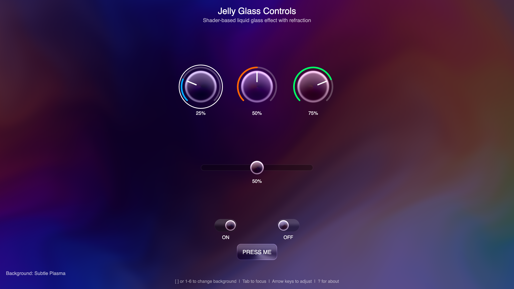
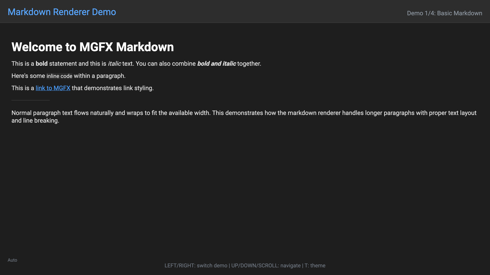
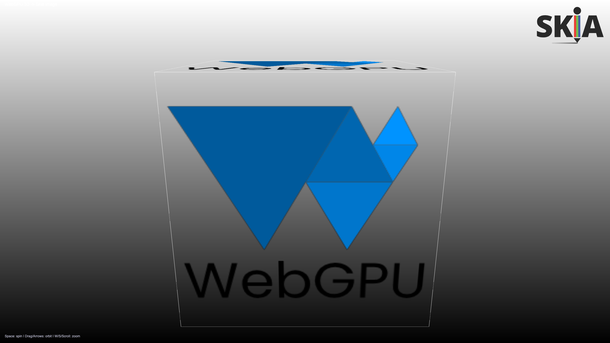
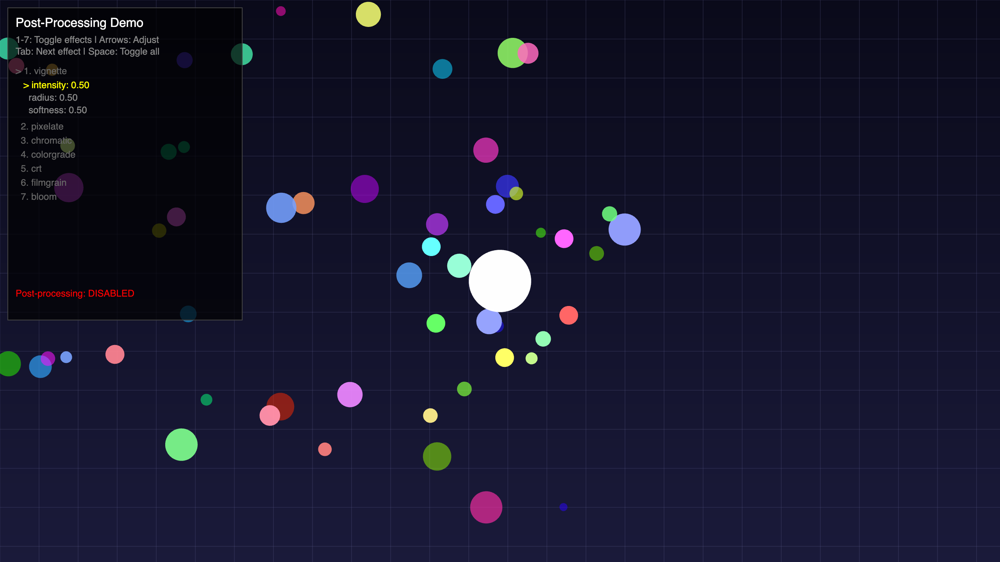
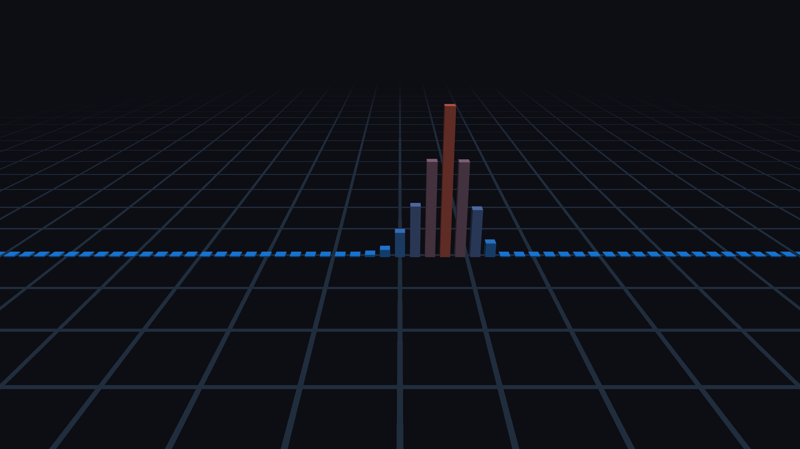
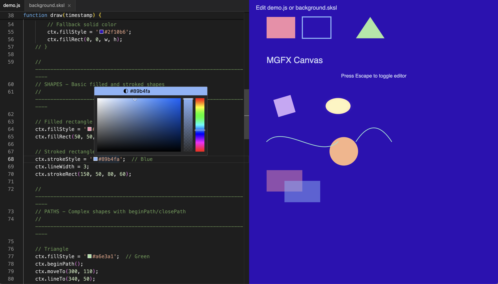
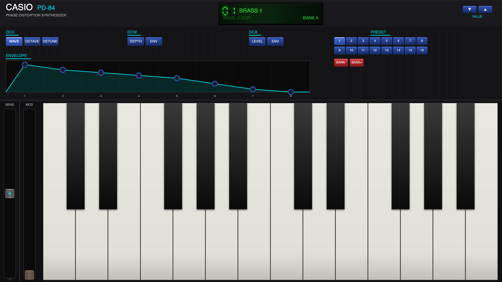
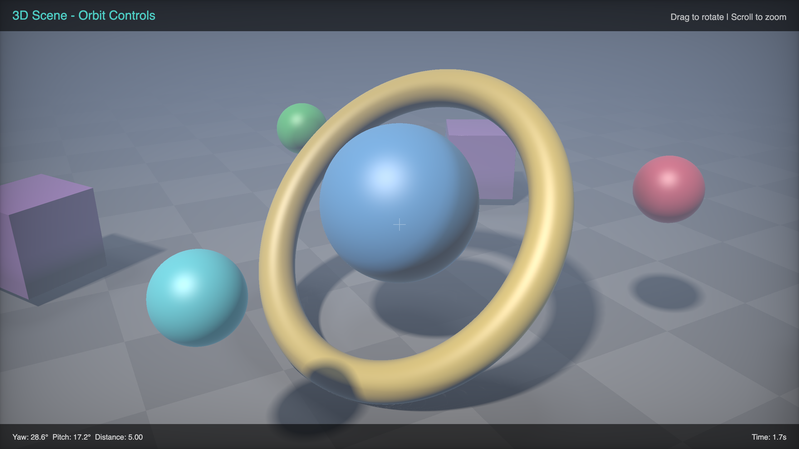

# iPlug3 - a manifesto

### Building an opinionated, cross-platform audio plug-in and application framework for the Agentic Era

---

iPlug3 is a ground-up reimagining of audio plug-in/app development, designed for a world where AI agentic workflows dramatically accelerate the iteration on DSP, UX, design and enable extreme creativity—not just extreme slop. It combines a minimal headless plug-in abstraction with a state-of-the-art graphics engine. This graphics engine has evolved into a capable framework in its own right—well suited for games, creative coding, and audiovisual artworks. The tech stack: [SDL3](https://wiki.libsdl.org/SDL3/FrontPage), [WebGPU native](https://dawn.googlesource.com/dawn) and [Skia](https://skia.org/) is a powerful combination, enabling beautiful visualizations that run at a solid 120 FPS. Sophisticated 2D and 3D interactive experiences can be written in JavaScript using familiar APIs that mirror their web counterparts, and those same scripts can run in the browser, with minimal runtime footprint. JavaScript enables hot-reloading, but writing UI and graphics code in C++ is also fine due to fast compilation speeds. Like iPlug2, you can put whatever UI framework you like on top of MPLUG - the audio plugin abstraction part of iPlug3.

## Why iPlug3?

The arrival of capable AI coding agents—Claude Code being the prime example—represents a fundamental shift in how we build software. Plug-in frameworks designed in the pre-agentic era carry assumptions that don't serve this new workflow: complex build systems, slow build times, platform-specific abstractions, and codebases that are difficult for AI to reason about.

iPlug3 was started on January 1st, 2026 with a clean slate. Rather than incrementally evolving iPlug2, this fresh approach embraces the new reality: agents that can read documentation, analyze screenshots, interrogate APIs, and iterate rapidly through spec-driven development, validating their work as they go.

**iPlug3 is the anti-slop plug-in framework.** In 2026 many text-to-audio-plug-in systems are appearing on the market (some based on iPlug2), but iPlug3 is not designed to generate a million _"wobble bass synth with a crazy UI"_ plugins. It's for developers who care deeply about their product— including the code, DSP and design—and who want to iterate using the latest tools as fast as possible, and keep their project flexible and maintainable.

I've been developing audio plug-ins for over 20 years, but the last five years working at [Ableton](https://ableton.com/) have taught me a lot. I've brought that industry experience to iPlug3—building it from the ground up with solid engineering practices. iPlug2's legacy codebase accumulated years of compromises and inconsistencies that were increasingly painful to work with. iPlug3 is a chance to do things right: clean abstractions, consistent naming, modern C++ idioms, and a codebase that's a pleasure to navigate—for humans and better for agents too.

## History

iPlug3 has a long lineage:

| Year | Milestone |
|------|-----------|
| **2008** | **iPlug 1** released by [Cockos](https://www.cockos.com/), makers of REAPER |
| **2011** | **[WDL-OL](https://github.com/olilarkin/wdl-ol)** — My fork published (used for [Endless Series](https://www.olilarkin.co.uk/index.php?p=eseries)) |
| **2014** | **iPlug 1.5** — Rebuilt on VST3 for [VirtualCZ](https://www.olilarkin.co.uk/index.php?p=virtualcz) (never shared publicly) |
| **2018** | **[iPlug 2](https://iplug2.github.io/)** with [Alex Harker](https://github.com/alexharker) — First plug-in framework to target the web via Emscripten, with Web Audio Module support (I was a co-author of [WAM v1](https://files01.core.ac.uk/download/pdf/144846764.pdf)), HiDPI, vector graphics |
| **2026** | **iPlug 3** — Greenfield project, Agentic-first architecture, minimal modern C++, SOTA graphics |

Over these years, iPlug2 powered an impressive range of commercial and open-source plug-ins: [Full Bucket Music](https://www.fullbucket.de/music/)'s 30+ vintage synth emulations, [Surreal Machines](https://www.surrealmachines.com/)' Impact/Modnetic/Diffuse, [Forever 89](https://forever89.studio/)'s Visco and Topos, the [Neural Amp Modeler](https://www.neuralampmodeler.com/the-code), and many more.

iPlug3 carries forward this legacy while embracing the tools and workflows of today head-on. It's a greenfield implementation—despite the name (which may change). It is not designed for backwards compatibility with iPlug2 and iPlug1 projects.

## Architecture

iPlug3 consists of two complementary component frameworks (names subject to change!):

### MPLUG — *Micro Plug-in Abstraction* (or *MyPlug*)

By "plug-in" we mean anything that processes audio with a plug-in-like interface—real-time in a DAW, offline for batch processing, or part of a machine learning pipeline used only for training. Write it once as a minimal, plain C++20 class using a clean abstraction. The API uses C++20 concepts rather than inheritance—your plug-in class is validated at compile-time without virtual function overhead. This produces cleaner error messages, faster runtime performance, and code that agents can reason about more effectively. Format adapters handle the rest. Whilst many projects are starting to use CLAP as a baseline format and wrap to other formats, a format-agnostic abstraction allows for better agentic workflows—the agent doesn't need to understand any particular plug-in format's quirks, and can better abstract to, for instance, Python bindings.

- **[CLAP](https://cleveraudio.org/), VST3, AU** — Desktop plug-in formats
- **AUv3** — Sandboxed, out-of-process audio plug-in format for iOS/visionOS
- **[WebCLAP](https://github.com/WebCLAP), [WAMv2](https://www.webaudiomodules.com/)** — Browser-based plug-ins
- **Standalone apps** — macOS, Windows, Linux, iOS, visionOS
- **Python/Node.js modules** — Scriptable plug-in instances
- **Leans on [CHOC](https://github.com/Tracktion/choc)** — High quality, ISC-licensed audio-related classes
- **MIDI2 support** — Via [libremidi](https://github.com/celtera/libremidi)
- **MPE support** — Built-in synth engine with per-note expression via MIDI Polyphonic Expression
- **Multi-bus architecture** — Main, auxiliary, and sidechain buses with optional activation

**WASM is a first-class citizen.** Building on my work with Web Audio Modules demonstrating iPlug2 compiling both DSP and UI for plug-ins running entirely in the browser  [see 2018 ADC presentation](https://www.youtube.com/watch?v=IRLxMhksUZ0), iPlug3 continues to treat the web as a primary target. WASM is inherently cross-platform and sandboxed—a compelling distribution model for the future. I am particulary excited therefore about supporting [WebCLAP](https://github.com/WebCLAP) - which I see as a great initiative for a portable plugin framework that can be the native plugin format of the future, as well as a great solution for Web-DAWs.

**Modern C++** - iPlug3 finally breaks away from the dependency on [Cockos WDL](https://www.cockos.com/wdl/) that iPlug has carried since 2008. I'm a fan of REAPER and WDL, however, WDL's custom string classes and containers are not ideal for agentic AI—their usage not widespread and they are poorly documented, so agents don't know them as well as standard C++. The plug-in abstraction uses pure standard C++20/STL with no legacy dependencies. CMake handles resource bundling, code signing, and all the platform-specific packaging that required custom scripts in iPlug2. CMake is notoriously painful to write—but that's exactly the kind of task you hand to an agent.

### MGFX — *Massive Graphics Abstraction* (or *MyGraphics*)

A standalone UI and creative coding framework that powers iPlug3's visual layer. Google's libraries (Dawn, Skia) are unfortunately quite large and difficult to build, but this is a trade-off I'm willing to accept for best-in-class quality and cross-platform reliability. In iPlug2 I tried to provide different backends offering lightweight or heavyweight solutions, but for MGFX I want to focus on the best—not worry about making it lightweight. I've been [thinking about these graphics architecture decisions for years](https://forum.juce.com/t/fr-improve-opengl-by-integrating-angle/64685/10?u=olilarkin). My project [skia-builder](https://github.com/olilarkin/skia-builder) builds prebuilt binaries for MGFX that get downloaded by CMake automatically.

- **WebGPU + [Dawn](https://dawn.googlesource.com/dawn)** — Modern GPU API with WGSL for cross-platform shaders
- **[Skia](https://skia.org/) Graphite** — GPU-accelerated 2D rendering with HTML5 Canvas-like API and SkSL
- **[SDL3](https://wiki.libsdl.org/SDL3/FrontPage)** — Cross-platform windowing, input, and system integration
- **jsengine** — Abstraction over QuickJS/V8/JavaScriptCore to provide the best JavaScript engine for each platform
- **Flexible resource/asset system** — Load images, fonts, shaders, and other assets from disk, memory, or embedded resources with a unified API
- **Extensive themeable widgets and 2D UI system** — Knobs, sliders, meters, and controls designed for audio UIs
- **Audio visualization system** — Metering ballistics, STFT processing abstractions, and lock-free queues for getting data to the UI in the fastest, most memory-efficient way possible
- **Post-processing effects** — Bloom, blur, CRT simulation, and other full-screen effects via offscreen render targets
- **Accessible by default** — Built-in cross-platform accessibility support
- **Cross-platform native integration** — File dialogs, message boxes, and popup menus that use the platform's native UI, or custom-styled popup windows rendered with your own look and feel
- **Multi-window support** — Independent windows for floating palettes, inspectors, custom popup menus, and multi-monitor workflows
- **Extensive examples** — Dozens of demos showcasing audio visualizers, 3D rendering, canvas drawing, and interactive controls

UI code can be written in JavaScript for rapid prototyping, but also in C++ using the same Canvas-like API. With iPlug3's fast build system and agent-assisted iteration, C++ may actually be preferable—you get the same quick feedback loop without the bridging complexity.

MGFX can be used independently for games, interactive art, visualizers, and tools.

### Gallery (just a few of many examples)

<table>
<tr>
<td align="center"> Liquid Glass Widgets</td>
<td align="center"> Markdown Rendering</td>
<td align="center"> Offscreen 3D</td>
</tr>
<tr>
<td align="center"> Post Processing</td>
<td align="center"> Audio Visualization</td>
<td align="center"> Monaco Editor (WebView)</td>
</tr>
<tr>
<td align="center"> glTF Model</td>
<td align="center"> Synth UI</td>
<td align="center"> Raytraced 3D (SkSL)</td>
</tr>
</table>

## Designed for Agents

iPlug3 is built with AI-assisted development as a first-class concern:

- **Fast builds** — Quick iteration for agent feedback loops
- **Sophisticated screenshot capture** — Visual validation via multimodal LLMs
- **MCP Native** — Plug-ins can be MCP servers, exposing their parameters, audio processing, and MIDI capabilities directly to AI agents via JSON-RPC. Claude Code and other agentic tools can control plug-ins programmatically—adjusting parameters, processing audio files, and validating behavior without manual intervention.
- **Hot-reloading** — Rapid prototyping without restart cycles
- **Parameterize everything** — APIs that agents can reason about and use for validation
- **DSLs are first class citizens** — [FAUST](https://faust.grame.fr/), [Cmajor](https://cmajor.dev/), and [JSFX](https://www.reaper.fm/sdk/js/js.php) can be integrated easily - with hot reloading in development and optimized codegen for production.

This enables workflows where agents analyze plug-in screenshots, follow user annotations, run validation tools (pluginval, auval, vstvalidator, asan, tsan, rtsan), and confirm expected behavior through short feedback loops.

## Plug-ins as MCP Servers

iPlug3 plug-ins can function as **Model Context Protocol (MCP) servers**. MCP is the emerging standard for AI agent tool integration, and iPlug3 is the first plug-in framework to support it natively.

What does this mean in practice? An AI agent like Claude can:
- Query a plug-in's parameters and current state
- Adjust parameters programmatically and hear the results
- Process audio files through the plug-in
- Send MIDI notes and control changes
- Validate expected behavior automatically

This transforms plug-in development from a manual, GUI-driven workflow into something that can be scripted, automated, and iterated upon by AI. The agent becomes a collaborator that can test your plug-in, compare A/B settings, and help you dial in the sound—all without touching a mouse.

## WebGPU Compute Shaders

WebGPU isn't just for graphics—it provides direct access to GPU compute shaders, opening up exciting possibilities for audio processing and beyond. Compute shaders excel at massively parallel workloads, and certain audio algorithms are a natural fit:

- **Additive synthesis** — Summing thousands of partials in parallel is a natural fit for the GPU
- **FFT-based processing** — Spectral analysis and resynthesis can leverage GPU parallelism
- **Physical modeling** — Large-scale waveguide networks and modal synthesis
- **Machine learning inference** — Running trained models for amp simulation, source separation, or generative audio

This is exploration territory—pushing the boundaries of what's possible when you combine modern GPU compute with real-time audio. The cross-platform nature of WebGPU (via Dawn) means these compute workloads run on Vulkan, Metal, and D3D12 backends without code changes. Projects like [gpu.cpp](https://github.com/AnswerDotAI/gpu.cpp) demonstrate the potential.

## Why Not Web Views?

Web views are increasingly popular for plug-in UIs, and they have real advantages: hot-reload workflows, highly optimized rendering, and tiny plug-in binaries since you're not shipping a graphics engine. But the runtime implications of WKWebView, Microsoft WebView2, and their Linux equivalents are hard to ignore:

1. **Cache pollution** — Web views dump files into system locations for caching. If this happens per-plug-in rather than per-host, you end up with multiple redundant caches. An unavoidable side effect of repurposing generic browser technology.

2. **Painful bridging** — Communicating between the web view and your C++ DSP/business logic is confusing and error-prone. Maintaining state in two separate contexts is overkill for most audio plug-in UIs.

3. **Visualization bottlenecks** — While the browser offers amazing visualization capabilities (three.js, etc.), getting real-time audio data from a low-latency C++ backend to the frontend is inefficient. WebView2 has shared memory APIs, but WebKit doesn't.

4. **Process explosion** — Open a web view GUI in a plug-in on Windows and watch your DAW spawn a constellation of subprocesses just to render a UI. It's dispiriting.

5. **Fighting the browser** — Repurposing browser technology means working around browser behaviors. Pointer locking requires C++ workarounds. File dialogs triggered from JavaScript use web-oriented APIs that may not suit your needs.

6. **First-load jank** — On every platform, there's an unavoidable flicker when the web view first initializes. It's a small thing, but it's always there.

7. **Memory footprint** — Web views have significant idle memory overhead (50-100MB+), even when displaying simple UIs.

8. **Security/sandboxing restrictions** — Web views enforce CORS, CSP, and other policies designed for the open web that can be very annoying in plugin development.

MGFX sidesteps all of this by providing native GPU-accelerated rendering with a web-like JavaScript API—the developer experience of the web without the browser runtime baggage.

Nevertheless, MGFX includes native WebView support based on the [WebView library I developed for iPlug2](https://github.com/iPlug2/iPlug2/tree/master/IPlug/Extras/WebView)—allowing integration of, for instance, the Monaco text editor into a UI or window.

## Inspirations

iPlug3 draws from the best ideas across graphics frameworks, plug-in architectures, and creative coding tools:

| Project | Influence |
|---------|-----------|
| **[iPlug2](https://iplug2.github.io/)** | UI agnosticism, Widget library, Minimal code |
| **[Window.js](https://windowjs.org/)** | Amazing project that inspired me and helped me get set up building Skia libs in the cloud |
| **[Sokol](https://github.com/floooh/sokol)** | Got me fascinated about graphics programming |
| **[React Native Skia](https://shopify.github.io/react-native-skia/)** / **[WebGPU](https://github.com/wcandillon/react-native-webgpu)** | Nice, but complex tooling, too tied to React ecosystem, not suited for plug-ins |
| **[Visage](https://github.com/VitalAudio/visage)** | High-performance GPU rendering techniques |
| **[Mystral Native](https://github.com/mystralengine)** | New games engine based on very similar thinking to iPlug3 - utilizes my work on [skia-builder](https://github.com/olilarkin/skia-builder) |

## Roadmap

### Current Status

- All MPLUG plug-in formats and examples (like iPlug2's) working and validating on all platforms
- Some gaps remain (e.g., state serialization) as different options are explored
- Many MGFX demos complete; currently refactoring and cleaning up examples
- **Supported Platforms**: macOS, Windows, Linux, iOS, visionOS, Web/WASM (Android TBC)

### v 0.0.1
- ETA - not sure - more tweaking needed.

## License

TBC

---

With iPlug3, I don't want to enable generating mediocre plug-ins from prompts. Whilst empowering more people to build their own audio software, iPlug3 is not designed to dumb down plug-in development—it's for creative people who really care about making high quality, innovative plug-ins and apps.

Join the discussion in the **#iplug3** channel on the [iPlug Discord](https://discord.com/invite/7h9HW8N9Ke).

*Oli Larkin, Berlin, Jan 2026*
